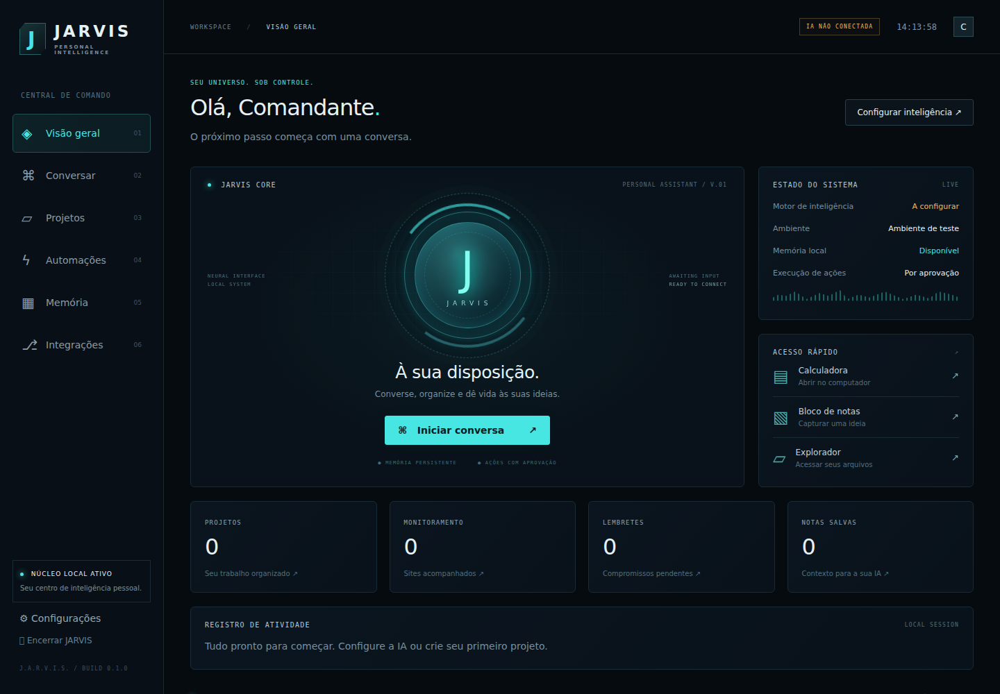

# JARVIS Personal Intelligence — 0.1.0

Assistente pessoal para Windows, com interface futurista em português.\n\n

## Download do executável

O GitHub Actions compila automaticamente o JARVIS para **Windows 10/11 x64** a partir deste código.

1. Abra a aba **Actions**.
2. Entre em **Build JARVIS for Windows**.
3. Abra a execução mais recente concluída com sucesso.
4. Em **Artifacts**, baixe **JARVIS-Windows**.
5. Extraia o artifact e abra `JARVIS.exe`.

Para compilar no próprio PC, instale Go e execute `build-windows.ps1`.


Esta é uma primeira versão funcional. Ela NÃO contém todas as capacidades do JARVIS fictício.

## Começar

1. Extraia todo o ZIP em uma pasta do computador.
2. Abra `JARVIS.exe`. Requer Windows 10/11 x64 (Intel/AMD de 64 bits).
3. A interface abre em uma janela do Microsoft Edge. Se o Edge não for encontrado, abre no navegador padrão.
4. Abra **Configurações**, informe seu nome, modelo e chave da API da OpenAI e salve.
5. Vá a **Conversar** e envie uma mensagem para testar sua chave.

Não precisa instalar Python, Node ou Go para usar o executável.
Conexão à internet e acesso à API são necessários para a IA. A chave não acompanha o programa.
Obtenha uma chave na sua própria conta: https://platform.openai.com/api-keys
Sua conta deve ter acesso ao modelo e faturamento/saldo da API. Não envie sua chave pelo chat.
O modelo inicial é `gpt-4.1-mini`, editável. A disponibilidade depende de sua conta. Use um modelo compatível com Chat Completions, ferramentas e, para anexos, visão.

## Recursos implementados

- Interface preta/ciano, núcleo animado e layout responsivo.
- Chat online com a API OpenAI, histórico local e modos de especialidade.
- Imagens PNG/JPG/WebP de até 5 MB para modelos com visão. Só o anexo da mensagem atual é enviado; imagens anteriores não são armazenadas nem reenviadas.
- Ditado por clique e leitura de respostas usando as capacidades do navegador. A disponibilidade e as vozes dependem do navegador/Windows; o reconhecimento pode usar o serviço online do navegador. Alternativa para ditar: foco na mensagem e Win + H.
- Memória principal e notas persistentes incluídas nas conversas.
- Cadastro e exclusão de projetos com URLs.
- Lembretes locais de ocorrência única e registro de atividade.
- Monitoramento HTTP de sites públicos, aproximadamente a cada minuto, enquanto o núcleo estiver em execução. Sites lentos podem aumentar o intervalo. Status HTTP não atesta o funcionamento de login ou pagamentos.
- Abertura de Calculadora, Bloco de notas e Explorador de arquivos do Windows.
- A IA pode propor abrir URLs/apps, salvar notas, criar lembretes e cadastrar monitores. É necessário clicar em Autorizar para executar cada proposta. Propostas não confirmadas expiram ao reiniciar o programa; ao recarregar a página, solicite novamente se necessário.
- Chave protegida com Windows DPAPI, associada à conta do Windows. A interface não recebe a chave salva.
- Serviço ligado apenas a 127.0.0.1, porta aleatória, token por sessão e verificação de origem.

## Limites desta entrega

Não implementados: controle autônomo de tela/mouse/teclado, captura contínua da tela, câmera ao vivo, palavra de ativação, execução de shell ou código, edição de arquivos e repositórios, busca web, múltiplos agentes independentes, envio de e-mails/WhatsApp, calendário externo, GitHub/deploy, servidores, pagamentos e dispositivos domésticos.
Os cartões de integrações indicam explicitamente esses limites. Não são conexões já prontas.
Os modos Programação, Análise e Organização são instruções para a mesma IA, não agentes independentes. Ela pode gerar código na conversa, mas não executá-lo.
Para chegar ao escopo completo, são necessárias novas implementações e autorização de cada conta ou dispositivo; conectar uma chave não adiciona essas funções.

## Funcionamento em segundo plano

Fechar a janela mantém o núcleo ativo para os monitores e lembretes. Abra o EXE novamente para reabrir a interface da sessão existente.
Use **Encerrar JARVIS** para finalizar o processo. Não há inicialização automática com o Windows nem ícone na bandeja nesta versão.
Lembretes aparecem no registro e como aviso quando a interface está aberta. Não são notificações nativas do Windows. O histórico registra lembretes vencidos ao reabrir; eles não funcionam com o PC desligado.
O programa aceita até 200 itens entre projetos, notas, lembretes e monitores. Guarde notas resumidas para controlar o volume de contexto enviado à IA.

## Dados, privacidade e custos

Dados locais em `%APPDATA%\JarvisPersonal`: `state.json` (conversas/notas/configurações), `jarvis.log` e `session.url` (sessão temporária).
A chave é criptografada, mas conversas e notas são texto local legível. Proteja a conta Windows e seus backups. Não salve senhas em notas.
O chat envia ao provedor a mensagem, as últimas até 30 mensagens, a memória e os itens cadastrados. O histórico local mantém até 200 mensagens. O envio de imagens ocorre apenas por anexo explícito.
O custo da API depende do modelo, das mensagens, dos anexos e do contexto enviado. Não há créditos ou uso ilimitado incluídos. O programa não transfere as conexões ou a assinatura deste ChatGPT.

## Solução de problemas

- IA não conectada: configure a chave. “Chave configurada” significa salva; a conexão só é testada ao enviar mensagem.
- Erro 401: confira a chave; 429: confira saldo/limites; 404: confira o modelo; 400: confirme suporte a ferramentas/imagens.
- Janela não abriu: confira `jarvis.log`. Abra o endereço completo de `session.url` em um navegador enquanto o processo estiver ativo.
- Chave não funciona em outro PC: configure-a novamente, pois a proteção DPAPI é vinculada ao usuário/ambiente Windows.
- Programa não inicia: confirme Windows x64 e extraia o ZIP antes de abrir. Não existe assinatura digital de editor neste protótipo; o Windows pode exibir uma confirmação de origem. O pacote inclui código-fonte e checksum para inspeção. Não é necessário desativar o antivírus.
- Dados não carregam: preserve uma cópia de `state.json` e do log para diagnóstico. Não apague seus dados antes de fazer backup.

## Código e compilação

Código completo na pasta `codigo-fonte`. Linguagens: Go + HTML/CSS/JavaScript; sem dependências Go externas.
Para compilar, instale Go 1.24 ou posterior (esta entrega foi compilada com 1.27.1): https://go.dev/dl/
No terminal, dentro de `codigo-fonte`:

```powershell
go test ./...
$env:GOOS = 'windows'
$env:GOARCH = 'amd64'
$env:CGO_ENABLED = '0'
go build -buildvcs=false -trimpath -ldflags='-s -w -H=windowsgui' -o JARVIS.exe .
```

## Validação e limites de teste

O executável foi compilado para Windows x64 e seu formato PE/GUI foi verificado.
Os testes automatizados cobrem persistência, autenticação da sessão, origem externa, URLs perigosas, exposição de chaves, aprovação/recusa, repetição de ações, ausência de chave e contrato do chat com resposta simulada.
A interface foi aberta em Chromium/Linux e os fluxos locais foram verificados.
Não houve execução nativa em Windows, teste da DPAPI no Windows, abertura real dos aplicativos Windows, teste de microfone/voz ou chamada real à OpenAI: não foi fornecida uma chave de API. Esses pontos precisam de validação no seu computador.

Referência da integração: https://developers.openai.com/api/reference/resources/chat/subresources/completions/methods/create
